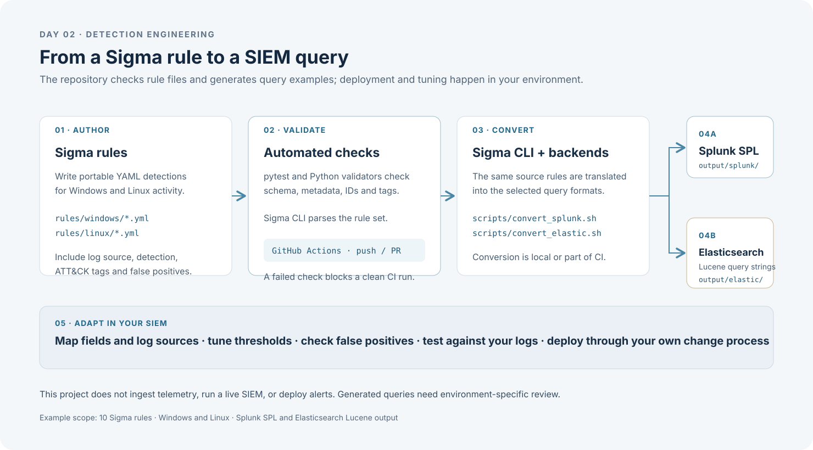
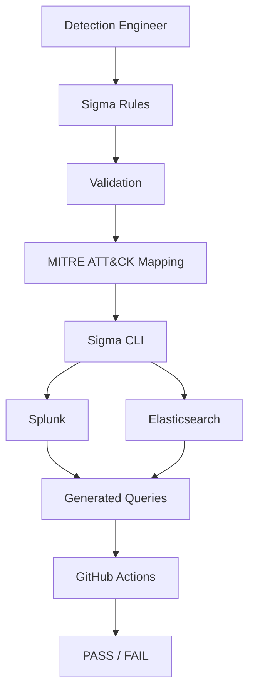

# Day 02 — Detection-as-Code Engineering Platform

A lightweight, portfolio-ready Detection Engineering project built around [Sigma](https://sigmahq.io/) rules, MITRE ATT&CK mapping, validation-driven quality gates, and multi-SIEM query generation.

> **Status:** Experimental portfolio project. Local validation and query conversion are documented in [`codex-review.md`](codex-review.md); no live SIEM testing has been performed.


---

## Table of Contents

- [Project Purpose](#project-purpose)
- [Business Application](#business-application)
- [What is Detection-as-Code?](#what-is-detection-as-code)
- [What is Sigma?](#what-is-sigma)
- [MITRE ATT&CK Mapping](#mitre-attck-mapping)
- [Project Architecture](#project-architecture)
- [Detection Inventory](#detection-inventory)
  - [Windows Detections](#windows-detections)
  - [Linux Detections](#linux-detections)
- [Validation System](#validation-system)
- [CI Pipeline](#ci-pipeline)
- [Splunk Conversion](#splunk-conversion)
- [Elasticsearch Conversion](#elasticsearch-conversion)
- [Repository Structure](#repository-structure)
- [Local Setup](#local-setup)
- [Running Tests](#running-tests)
- [Running Validation](#running-validation)
- [Converting Rules](#converting-rules)
- [Telemetry Requirements](#telemetry-requirements)
- [Correlation](#correlation)
- [False-Positive Considerations](#false-positive-considerations)
- [Limitations](#limitations)
- [Future Improvements](#future-improvements)

---

## Project Purpose

This repository demonstrates how a small detection engineering team can manage detection logic as code:

- Write platform-agnostic detections in Sigma.
- Map every detection to MITRE ATT&CK.
- Enforce quality gates with Python validation and pytest.
- Convert rules to Splunk SPL and Elasticsearch queries without deploying those platforms.
- Automate the entire workflow with GitHub Actions.

The project is intentionally lightweight: no Docker, no VMs, no databases, and no live SIEM instances are required.

## Business Application

Use this repository as a starting point for managing Sigma rules as code. Engineers author rules in YAML; CI checks syntax, required metadata, unique IDs, and ATT&CK tags, then Sigma CLI converts the rules into Splunk SPL and Elasticsearch Lucene query strings.

A team can review the generated queries, map fields and log sources to its own telemetry, tune thresholds and false-positive handling, and test the results before deployment. The project itself does not ingest logs or deploy detections.



---

## What is Detection-as-Code?

Detection-as-Code (DaC) treats security detection logic the same way software teams treat application code:

- Detections live in version control.
- Changes are reviewed through pull requests.
- Automated tests validate syntax, metadata, and mapping quality.
- Generated artifacts (SIEM queries) are produced by the pipeline.

This approach improves consistency, auditability, and collaboration between detection engineers, threat intelligence analysts, and SOC operators.

---

## What is Sigma?

Sigma is a generic, open signature format for describing log detections in YAML. A single Sigma rule can be converted into queries for Splunk, Elasticsearch, Microsoft Sentinel, Chronicle, and many other backends.

This project uses Sigma so that detection logic stays portable and vendor-neutral.

---

## MITRE ATT&CK Mapping

Every rule includes MITRE ATT&CK tactic and technique tags in the `tags` field. The mapping is documented in detail in [`docs/mitre-mapping.md`](docs/mitre-mapping.md).

---

## Project Architecture



A higher-resolution version of this diagram is available in [`diagrams/detection-pipeline.mmd`](diagrams/detection-pipeline.mmd). The complete usage flow is shown in [Business Application](#business-application).

---

## Detection Inventory

### Windows Detections

| Rule | File | Technique | Level |
|---|---|---|---|
| Suspicious Encoded PowerShell Execution | [`rules/windows/win_suspicious_encoded_powershell.yml`](rules/windows/win_suspicious_encoded_powershell.yml) | T1059.001, T1027 | high |
| Windows Defender Protection Disabled | [`rules/windows/win_defender_disabled.yml`](rules/windows/win_defender_disabled.yml) | T1562.001 | high |
| Windows Failed Logon Event | [`rules/windows/win_multiple_failed_logons.yml`](rules/windows/win_multiple_failed_logons.yml) | T1110 (threshold correlation required) | medium |
| User Added to Privileged Local Group | [`rules/windows/win_privileged_group_change.yml`](rules/windows/win_privileged_group_change.yml) | T1098.007 | high |
| Suspicious Scheduled Task Creation | [`rules/windows/win_scheduled_task_creation.yml`](rules/windows/win_scheduled_task_creation.yml) | T1053.005 | medium |
| New Windows Service Creation (System Event 7045) | [`rules/windows/win_new_service_creation.yml`](rules/windows/win_new_service_creation.yml) | T1543.003 | low |

### Linux Detections

| Rule | File | Technique | Level |
|---|---|---|---|
| Failed SSH Authentication Event | [`rules/linux/linux_multiple_failed_ssh.yml`](rules/linux/linux_multiple_failed_ssh.yml) | T1110 (threshold correlation required) | medium |
| Linux Shell History Clearing | [`rules/linux/linux_shell_history_clear.yml`](rules/linux/linux_shell_history_clear.yml) | T1070.003 | medium |
| Sudo Authentication Failure Event | [`rules/linux/linux_sudo_failures.yml`](rules/linux/linux_sudo_failures.yml) | T1110 (threshold correlation required) | medium |
| Account Discovery on Linux | [`rules/linux/linux_account_discovery.yml`](rules/linux/linux_account_discovery.yml) | T1087, T1087.001 | low |

---

## Validation System

The validation layer is implemented in plain Python using only the standard library plus `PyYAML`.

Scripts:

- [`scripts/validate_rules.py`](scripts/validate_rules.py) — full rule validation suite
- [`scripts/check_metadata.py`](scripts/check_metadata.py) — metadata-only checks
- [`scripts/check_attack_tags.py`](scripts/check_attack_tags.py) — ATT&CK mapping checks

Checks performed:

- YAML parses successfully
- Required fields are present (`title`, `id`, `status`, `description`, `author`, `date`, `logsource`, `detection`, `falsepositives`, `level`, `tags`)
- Rule ID is a valid UUID v4
- No duplicate UUIDs exist
- At least one MITRE ATT&CK technique tag is present
- False-positive guidance is documented
- Severity level is one of `informational`, `low`, `medium`, `high`, `critical`

---

## CI Pipeline

[`.github/workflows/detection-ci.yml`](.github/workflows/detection-ci.yml) runs on every push and pull request to `main`:

1. Checkout repository
2. Set up Python 3.12
3. Install dependencies
4. Run pytest
5. Run rule validation
6. Run metadata validation
7. Run ATT&CK validation
8. Run Sigma parsing and validation
9. Convert rules to Splunk SPL
10. Convert rules to Elasticsearch Lucene query strings

CI installs the pinned Sigma CLI and both pinned backends, fails on parsing, enabled validation issues, or conversion errors, and uses read-only repository permissions. The CLI's bundled ATT&CK catalog is behind the current ATT&CK taxonomy, so its `attacktag` validator is excluded; rule tag syntax is checked locally and technique references are documented in [`docs/mitre-mapping.md`](docs/mitre-mapping.md). Actions are pinned to immutable commit SHAs.

---

## Splunk Conversion

```bash
pip install -e ".[sigma]"
bash scripts/convert_splunk.sh
```

Converted queries are written to `output/splunk/`.

---

## Elasticsearch Conversion

```bash
pip install -e ".[sigma]"
bash scripts/convert_elastic.sh
```

Converted Elasticsearch Lucene query strings are written to `output/elastic/`. These are Lucene queries, not Elasticsearch Query DSL or ES|QL.

---

## Repository Structure

```
day-02-detection-engineering/
├── README.md
├── codex-review.md
├── report.md
├── LICENSE
├── .gitignore
├── requirements.txt
├── pyproject.toml
├── rules/
│   ├── windows/
│   └── linux/
├── scripts/
│   ├── validate_rules.py
│   ├── check_metadata.py
│   ├── check_attack_tags.py
│   ├── convert_splunk.sh
│   └── convert_elastic.sh
├── tests/
│   ├── test_rule_schema.py
│   ├── test_metadata.py
│   ├── test_attack_mapping.py
│   └── test_unique_ids.py
├── output/
│   ├── splunk/
│   └── elastic/
├── docs/
│   ├── architecture.md
│   ├── detection-methodology.md
│   ├── mitre-mapping.md
│   ├── telemetry-requirements.md
│   ├── false-positive-analysis.md
│   ├── correlation-strategies.md
│   └── lessons-learned.md
├── evidence/
│   ├── validation/
│   ├── conversion/
│   └── github-actions/
├── diagrams/
│   └── detection-pipeline.mmd
└── .github/
    └── workflows/
        └── detection-ci.yml
```

---

## Local Setup

```bash
python -m venv .venv
source .venv/bin/activate
pip install -r requirements.txt
```

Optional SIEM conversion dependencies (install if conversion is needed):

```bash
pip install -e ".[sigma]"
```

---

## Running Tests

```bash
python -m pytest -v
```

---

## Running Validation

```bash
python scripts/validate_rules.py
python scripts/check_metadata.py
python scripts/check_attack_tags.py
```


---

## Converting Rules

Install the optional converter dependencies first. The scripts can find the local `.venv/bin/sigma` command even when the virtual environment is not activated.

```bash
bash scripts/convert_splunk.sh
bash scripts/convert_elastic.sh
```


---

## Telemetry Requirements

Each rule documents the telemetry that would be required for the detection to fire. See [`docs/telemetry-requirements.md`](docs/telemetry-requirements.md) for the complete list.

In general:

- Windows rules require Windows Security event logs, PowerShell logging, process creation telemetry, and optionally Sysmon.
- Linux rules require auth logs, sshd logs, sudo logs, journald, and process or audit telemetry where applicable.

These telemetry sources are not assumed to be present by default; they must be enabled and collected before the detections become operational.

## Correlation

The Windows failed-logon, SSH authentication-failure, and sudo-failure Sigma rules each match a single event. They do not count events or implement a time window. Suggested group-by fields and starting thresholds are documented in [`docs/correlation-strategies.md`](docs/correlation-strategies.md).

---

## False-Positive Considerations

Each rule includes a `falsepositives` section describing realistic benign activity. See [`docs/false-positive-analysis.md`](docs/false-positive-analysis.md) for detailed guidance.

Common benign sources include:

- Legitimate PowerShell administration and automation
- Software installation and patching
- IT configuration management tools
- Administrators creating services or scheduled tasks
- Password mistakes and troubleshooting

---

## Limitations

- This is a base implementation, not a production detection repository.
- Sigma rules are written for lab and portfolio demonstration purposes.
- Field names and event IDs assume common Windows/Linux logging configurations.
- Conversion to Splunk SPL and Elasticsearch Lucene query strings requires optional pySigma backend plugins.
- No real SIEM instances, agents, or log shippers are included.
- Failed-authentication thresholds are operational guidance; correlation is not implemented in these Sigma event rules.

---

## Future Improvements

- Add backend-specific configuration files (splunk.yml, elasticsearch.yml).
- Expand the rule set with network and file-based detections.
- Add sigma filter files for environment-specific exclusions.
- Integrate Sigma correlation rules for multi-stage attack chains.
- Add severity scoring based on CVSS or DREAD-like risk model.
- Implement unit tests for generated SIEM queries.
- Add pre-commit hooks for rule validation.
- Store real execution evidence in the `evidence/` directory.

---

## License

This project is released under the MIT License. See [`LICENSE`](LICENSE) for details.
