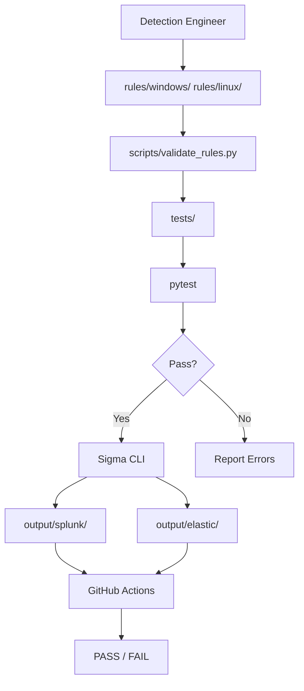

# Architecture

## Overview

The Detection-as-Code Engineering Platform is a lightweight, file-based pipeline that turns Sigma rules into validated, mapped, and convertible detection logic.

## Components

| Component | Responsibility |
|---|---|
| Sigma Rules | Vendor-neutral detection definitions written in YAML. |
| Python Validators | Enforce schema, metadata, UUID, ATT&CK, and severity rules. |
| pytest Suite | Automate validation checks as unit tests. |
| Sigma CLI | Parse rules and convert them to SIEM-specific queries. |
| Conversion Scripts | Generate Splunk SPL and Elasticsearch Lucene query strings locally. |
| GitHub Actions | Run validation and conversion on every change. |
| Documentation | Record telemetry needs, false positives, and methodology. |

## Data Flow

## Design Decisions

- **No external runtime dependencies**: The project does not require Docker, VMs, databases, or live SIEM instances.
- **Plain Python + PyYAML**: Keeps validation lightweight and easy to audit.
- **Optional SIEM backends**: Local Python validation does not require the pySigma backends; the full CI workflow installs them and requires both conversions to pass.
- **Evidence directories**: Reserved for screenshots, logs, and artifact captures from future test runs.

## File Organization

- `rules/` — Source of truth for all detection logic.
- `scripts/` — Executable validation and conversion tools.
- `tests/` — pytest coverage for rule quality.
- `output/` — Generated SIEM queries (ignored by git except `.gitkeep`).
- `docs/` — Human-readable design and operational documentation.
- `evidence/` — Captured validation and CI evidence.
- `diagrams/` — Visual pipeline artifacts.
- `.github/workflows/` — CI/CD definition.
